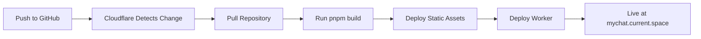

# Deployment Guide

## Overview

MyChat uses **Cloudflare's pull-based deployment** system. This means:
- ✅ Cloudflare automatically pulls from your GitHub repository
- ✅ No GitHub Actions needed for deployment
- ✅ Builds happen on Cloudflare's infrastructure
- ✅ Automatic deployments on every push to main

## Setup Cloudflare Deployment

### 1. Connect GitHub Repository

1. Go to [Cloudflare Dashboard](https://dash.cloudflare.com/)
2. Navigate to **Workers & Pages** → **Create application**
3. Select **Pages** → **Connect to Git**
4. Authorize GitHub and select `currentspace/MyChat` repository
5. Configure build settings:
   ```
   Framework preset: None
   Build command: pnpm build
   Build output directory: dist
   Root directory: /
   ```

### 2. Environment Variables

Set these in Cloudflare Pages settings:

#### Build Environment Variables
```
NODE_VERSION=20
VITE_GOOGLE_CLIENT_ID=your-client-id.apps.googleusercontent.com
```

#### Production Secrets (for Worker)
Add via wrangler CLI:
```bash
pnpm wrangler secret put GOOGLE_CLIENT_ID --env production
pnpm wrangler secret put JWT_SECRET --env production
```

### 3. Build Configuration

Cloudflare will automatically:
1. Install dependencies with `pnpm install`
2. Run `pnpm build` 
3. Deploy the `dist` folder as static assets
4. Deploy the Worker from `src/index.js`

## Local Development

### Setup
```bash
# Install dependencies
pnpm install

# Create environment file
cp .env.local.example .env.local
# Edit .env.local with your Google Client ID

# Run development server
pnpm dev
```

### Build Locally
```bash
# Build for production
pnpm build

# Test production build
pnpm preview
```

### Test Worker Locally
```bash
# Run Worker in development mode
pnpm wrangler dev

# Or with remote data
pnpm wrangler dev --remote
```

## Deployment Flow



## Environment Variables

### Client-Side (Vite)
These are injected at build time:
- `VITE_GOOGLE_CLIENT_ID` - Google OAuth Client ID

### Server-Side (Worker)
These are secrets stored in Cloudflare:
- `GOOGLE_CLIENT_ID` - Google OAuth Client ID
- `JWT_SECRET` - Secret for JWT signing
- `OPENAI_API_KEY` - OpenAI API key (optional)
- `ANTHROPIC_API_KEY` - Anthropic API key (optional)

## Monitoring Deployments

1. **Cloudflare Dashboard**: View deployment status and logs
2. **Build Logs**: Check for build errors in Cloudflare Pages
3. **Worker Logs**: Use `pnpm wrangler tail --env production`

## Rollback

To rollback to a previous deployment:
1. Go to Cloudflare Pages dashboard
2. Select your project
3. Go to **Deployments** tab
4. Find the previous working deployment
5. Click **Rollback to this deployment**

## Troubleshooting

### Build Fails
- Check Node version (should be 20+)
- Verify all dependencies in package.json
- Check build logs in Cloudflare dashboard

### OAuth Not Working
- Verify `VITE_GOOGLE_CLIENT_ID` is set in Cloudflare Pages environment
- Check Worker secrets are configured
- Ensure authorized domains include `mychat.current.space`

### Worker Not Executing
- Check `wrangler.toml` configuration
- Verify `run_worker_first = ["/api/*"]` is set
- Check Worker logs with `wrangler tail`

## Important Notes

- ❌ No GitHub Actions needed - Cloudflare pulls automatically
- ✅ Every push to `main` triggers a deployment
- ✅ Preview deployments for pull requests
- ✅ Rollback capability for quick fixes
- ✅ Build happens on Cloudflare's infrastructure